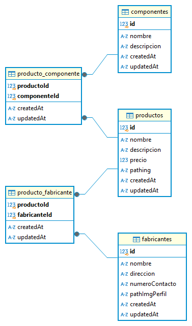

# Proyecto de Persistencia

Este proyecto contiene una API de gestión de productos. A continuación, se detallan las instrucciones necesarias para la instalación y ejecución de la API.

## Requisitos Previos

- Node.js (versión 14 o superior)
- npm (versión 6 o superior)

## Instalación

1. Clona el repositorio en tu máquina local:
    ```bash
    git clone https://github.com/EP-2024C2/tp-ntom-persistenciagrupo
    ```
2. Navega al directorio del proyecto:
    ```bash
    cd tp-ntom-persistenciagrupo
    ```
3. Instala las dependencias necesarias:
    ```bash
    npm install
    ```

## Ejecución

1. Inicia la API:
    ```bash
    npm start
    ```
2. La API estará disponible en `http://localhost:3000`.

## Scripts Disponibles

- `npm run dev`: Inicia la API en modo de desarrollo con recarga automática.

## DER


